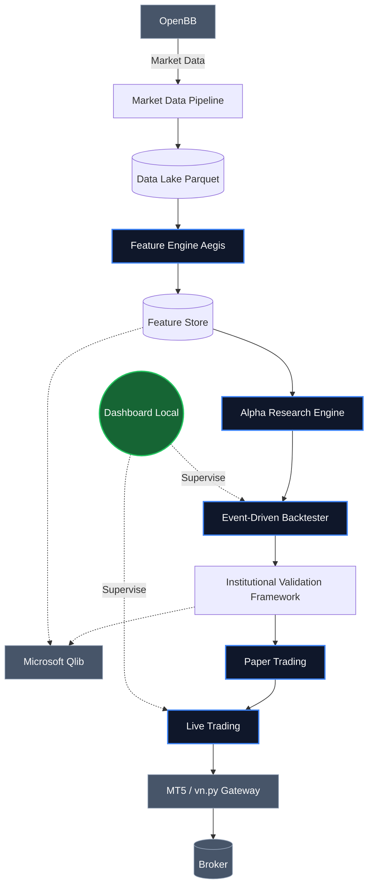

# Architecture Système — Aegis Quant OS

Aegis Quant OS repose sur une **Architecture Hexagonale (Ports et Adapters)** couplée au **Domain Driven Design (DDD)**. 
L'objectif est d'isoler strictement la logique de trading (Domain & Engine) des détails d'implémentation externes (Data Providers, Brokers, LLMs, UIs). 
Les frameworks externes (Qlib, OpenBB) ne sont que des moteurs spécialisés, ils ne possèdent jamais la logique métier.

## Pipeline Quantitatif Officiel

Le schéma ci-dessous illustre le flux de données validé, de bout en bout.

## Les Couches Majeures

### 1. Market Data Pipeline & Data Lake
Extrait la donnée brute via OpenBB, la valide et la stocke de manière performante au format Parquet pour éviter de re-télécharger l'historique en boucle.

### 2. Feature Engine (100% Propriétaire)
Calcule les indicateurs techniques (EMA, RSI, MACD, etc.) en pur Python/Pandas/Numpy. Les dépendances externes comme TA-Lib ou Qlib ne sont **jamais** utilisées ici. Aegis possède sa propre mathématique.

### 3. Alpha Research Engine
Évalue la puissance prédictive des features (IC Pearson, IC Spearman, Information Ratio) générées par le Feature Engine pour trier le bruit du signal.

### 4. Event-Driven Backtester
Le moteur de simulation qui intègre le `PortfolioEngine` (Sizing) et le `GlobalRiskManager` (Kill Switch). Il rejoue l'historique tick par tick ou barre par barre.

### 5. Institutional Validation Framework
Le laboratoire scientifique de validation. Il orchestre le Backtester sur de multiples scénarios (Walk-Forward, Hold-Out, Multi-Market, Monte Carlo) pour évaluer la robustesse statistique et économique d'une stratégie et générer un score global, avant de l'approuver pour la production ou le ML.

### 6. Microsoft Qlib (Accélérateur)
Utilisé **uniquement** pour la recherche et l'entraînement de modèles de Machine Learning. Qlib consomme le Feature Store d'Aegis, il ne produit pas ses propres features. Il n'est déployé que sur des stratégies ayant survécu à la Validation Institutionnelle.

### 7. Execution Gateway
La couche anti-corruption pour communiquer avec les brokers finaux (vn.py, MT5).

### 8. Dashboard (Centre de Contrôle)
Une interface de supervision locale permettant de lire l'état de l'Equity, du Drawdown, des positions et du Risk Manager. Aucune logique métier n'y réside.
